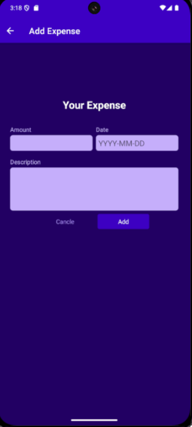
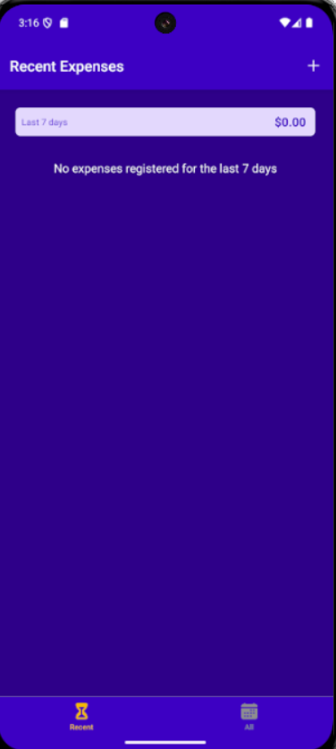

# 💰 Expense Tracker App

A simple and elegant **React Native + Expo** app to track your daily expenses.  
Add, edit, and view your spending with a clean interface and categorized expense list.

---

## 🚀 Features

- ➕ Add new expenses  
- ✏️ Edit or delete existing expenses  
- 📅 View recent (last 7 days) and all expenses  
- 💾 Data persistence using Firebase or local storage  
- 🎨 Simple, responsive, and user-friendly UI  
- 🧭 Navigation between screens using **React Navigation**

---

## 📱 Screenshots

| All Expenses | Manage Expense | Recent Expenses |
|---------------|----------------|-----------------|
|  |  |  |

*(Save your screenshots in `assets/screenshots/` and rename accordingly.)*

---

## 🛠️ Installation & Setup

1. Clone this repository:
   ```bash
   git clone https://github.com/yourusername/expense-tracker.git
   ```
2. Navigate into the project:
   ```bash
   cd expense-tracker
   ```
3. Install dependencies:
   ```bash
   npm install
   ```
4. Start the app:
   ```bash
   expo start
   ```
5. Scan the QR code using Expo Go to launch it on your phone.

---

## 🤝 Contributing

Contributions are welcome! Please open an issue or submit a pull request.
